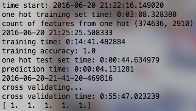
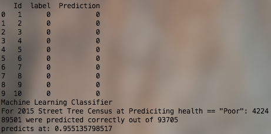

## Discussion	
* Building a Machine Learning classifier to Predict "Poor" Health Trees 
	* for 2015 Street Tree Census Data 	
	* with 95.5% accuracy

## Discussion
* Trees Count Data Jam
	* Data munging
	* Geoprocessing with PostGIS
	* Displaying data interactively on the CartoDB platform 
	* Transparency of code/methods on GitHub

## Machine Learning to Predict "Poor" Health Trees

<iframe width="100%" height="520" frameborder="0" src="https://nygeog.cartodb.com/viz/2c53bb20-373a-11e6-b8d2-0e5db1731f59/embed_map" allowfullscreen webkitallowfullscreen mozallowfullscreen oallowfullscreen msallowfullscreen></iframe>

<iframe width="100%" height="520" frameborder="0" src="https://nygeog.cartodb.com/viz/855a44c8-3749-11e6-9875-0e787de82d45/embed_map" allowfullscreen webkitallowfullscreen mozallowfullscreen oallowfullscreen msallowfullscreen></iframe>

#### Machine Learning
["Machine learning is a method of data analysis that automates analytical model building..."](http://www.sas.com/en_id/insights/analytics/machine-learning.html) 

#### Machine Learning
["... Using algorithms that iteratively learn from data, ..."](http://www.sas.com/en_id/insights/analytics/machine-learning.html) 

#### Machine Learning
["... machine learning allows computers to find hidden insights without being explicitly programmed where to look."](http://www.sas.com/en_id/insights/analytics/machine-learning.html) ~ SAS website

#### Different from Inferential Statistics! 

#### Difference
* [When you do statistics, you want to infer the process by which data you have was generated.](http://stats.stackexchange.com/questions/6/the-two-cultures-statistics-vs-machine-learning) ~ stats.stackexchange

#### Difference
* [When you do machine learning, you want to know how you can predict what future data will look like w.r.t. some variable.](http://stats.stackexchange.com/questions/6/the-two-cultures-statistics-vs-machine-learning) ~ stats.stackexchange

<iframe src="http://docs.google.com/gview?url=https://dl.dropboxusercontent.com/u/36281098/pdf/coms4721-practical-modeling-project-report-dms2203.pdf&embedded=true" style="width:100%; height:600px;" frameborder="0"></iframe>

Supervised Machine Learning

### [Code for Machine Learning for NYC Street Trees Census: Predicting "Poor" health Trees](https://github.com/nyctreescountdatajam/nyctreescountdatajam_ml)
_click_

#### Ensemble Method used:
[sklearn.ensemble.RandomForestClassifier](http://scikit-learn.org/stable/modules/generated/sklearn.ensemble.RandomForestClassifier.html)

#### Model and Cross Validation

#### 95.51% Accuracy in predicting "Poor" tree health

#### Feature Importances
* Can identify important features for prediction
* However, would need to revisit One-Hot encoding so identify feature columns would be more intuitive (readable). 

## [NYC Parks Data Jam](http://nyctreescountdatajam.github.io/)
_click_