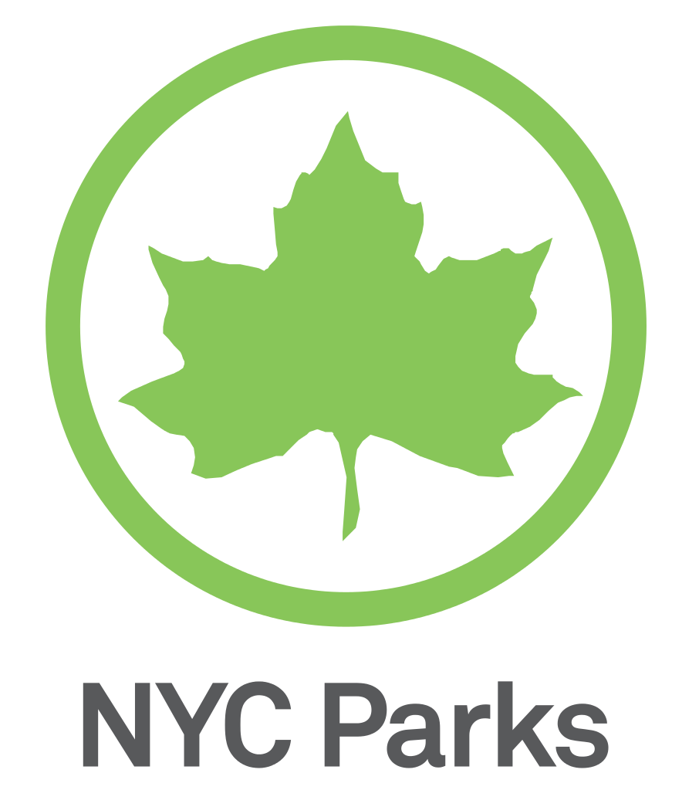

## Other Projects and Research
[Personal Website: nygeog.com](http://nygeog.github.io/)
<!-- ## Preferred Sklls -->
<!-- #### Analysis Skills
* data mining
* time-series analyses
* machine learning algorithms
* decision models
* prediction and 
* experimental research and statistical design. -->
<!-- #### Analytical Programming: Demonstrated expertise  
* statistical,
* analytical and 
* data visualization software,-->
<!-- #### Especially with
* ArcGIS, 
* SQL tools, 
* Python, 
* R and 
* d3.js. -->
<!-- #### Close with link to Resume, Website, etc. -->

## Questions for NYC Parks

#### Technological Autonomy
* Hardware preferences
	* Mac 
	* Linux
	* AWS 

#### Budget? 
* AWS for data/applications
	* API-like wrappers
	* Highly available  
* CartoDB for mapping
* Most other tools could be FOSS	

#### Transparency?
* Require (?) all code (without PII or sensitive data) to be posted to agency GitHub
	* RE: [Chris Whong at NYC Planning](https://github.com/NYCPlanning)  

# Thanks!
